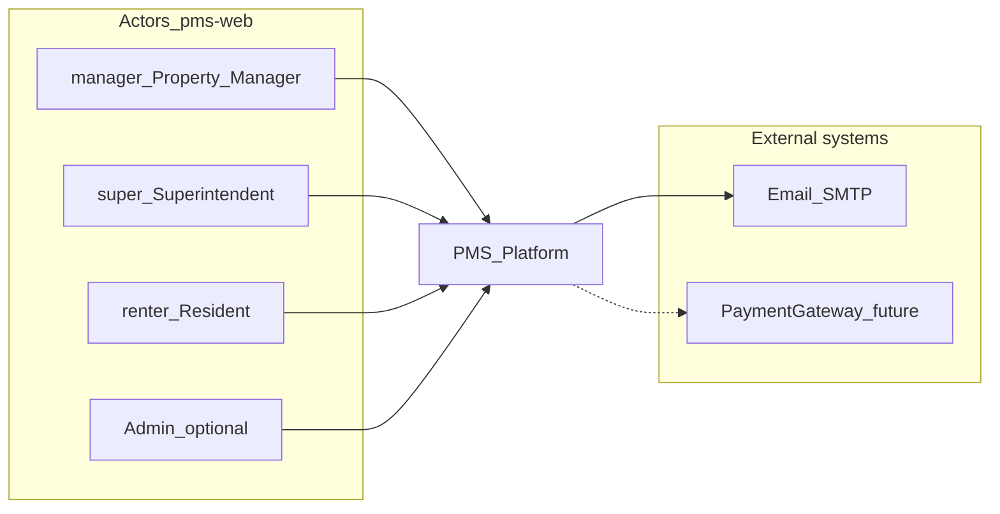
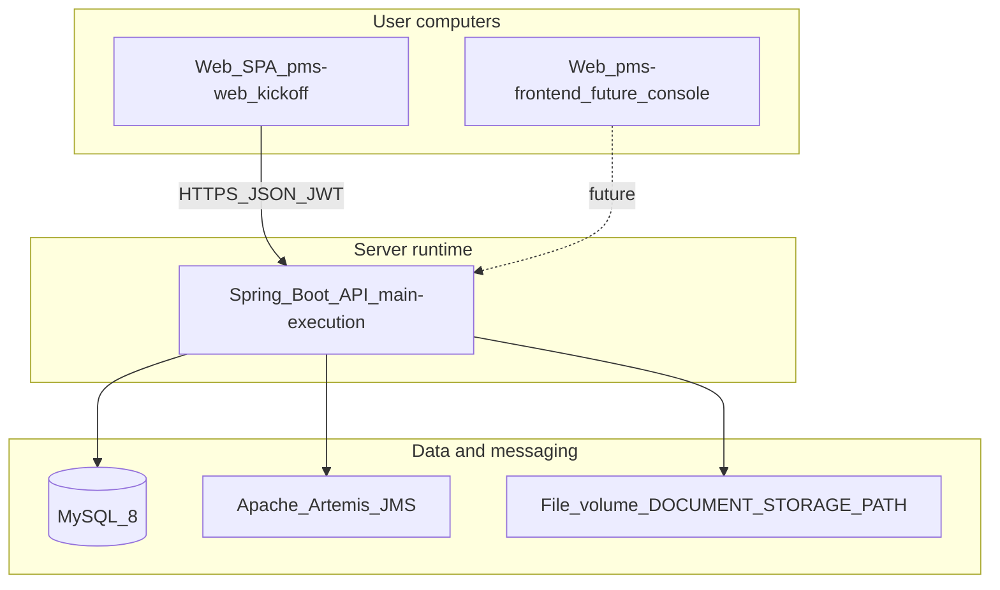
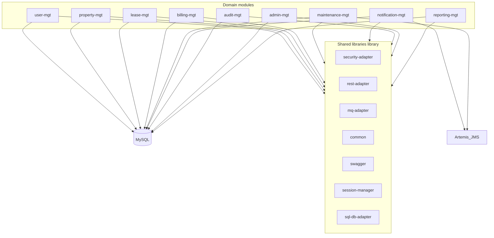

# Architecture (C4 views)

C4 model for the PMS workspace: **context**, **container**, and **component** (backend modules). **Primary client for kickoff:** [`pms-web`](../pms-web/) (roles `manager`, `super`, `renter` — see [`types/index.ts`](../pms-web/src/types/index.ts)). Maven layout: [pms-backend/README.md](../pms-backend/README.md).

## Level 1 — System context

Actors match the **`pms-web`** login personas (Property Manager, Superintendent, Resident).

**Notes**

- **Payment gateway** is optional later; the web prototype already models rent payments in UI state.
- **Resident** login URL uses `resident`; app role remains `renter` in [`LoginPage.tsx`](../pms-web/src/pages/login/LoginPage.tsx).

## Level 2 — Containers

Deployable units and data stores.

**Technology choices** (from README)

| Container | Technology |
|-----------|------------|
| Web SPA | **`pms-web`** (kickoff); `pms-frontend` optional later console |
| API | Spring Boot 3.4.x, Java 17, `com.pms.platform` |
| Database | MySQL 8, schema via Liquibase |
| Async messaging | Spring JMS + Apache Artemis |
| Documents | Configurable filesystem path `DOCUMENT_STORAGE_PATH` |

**Runtime flow**

1. Browser obtains JWT from `/auth/login` (user module).
2. API validates JWT (`library/security-adapter` filters).
3. Domain services persist to MySQL; publish domain events to Artemis where modules use `MQClientService` (e.g. login event in `AuthServiceImpl`).
4. Notification and other consumers process messages asynchronously.

## Level 3 — Components (backend modules)

Logical modules inside the Spring Boot application (Maven modules under `pms-backend/modules/`).

**Per-module responsibility**

| Module | Responsibility |
|--------|----------------|
| `user` | Auth, profile, roles, activation |
| `property` | Property → building → unit hierarchy |
| `lease` | Lease lifecycle and linkage to units |
| `billing` | Charges, invoices, payments, aging |
| `maintenance` | Work orders and SLA-oriented workflow |
| `notification` | Templates, delivery, in-app + email |
| `audit` | Immutable activity trail |
| `admin` | Tenant configuration, user management orchestration |
| `reporting` | Aggregates and exports |

**Cross-cutting**

- **JMS**: use for decoupled notifications and future outbox-style processing; keep publishers idempotent where duplicates are possible.
- **Document storage**: lease PDFs, work-order photos; path from env, not committed secrets.

## Level 4 (optional sketch — not fully enumerated)

Within each `*-mgt` module: REST controllers (often generated from `_swagger`), services, JPA repositories, Liquibase changelogs in sibling `_liquibase` folders. Defer detailed class diagrams until a single module is refactored.

## Related documents

- [RBAC-AND-DATA-SCOPE.md](./RBAC-AND-DATA-SCOPE.md) — authorization and row scope (`pms-web` roles).
- [BACKEND-ROLE-ALIGNMENT.md](./BACKEND-ROLE-ALIGNMENT.md) — backend seeds and JWT aligned with web.
- [DELIVERY-PHASES-EPICS.md](./DELIVERY-PHASES-EPICS.md) — phased delivery order.
