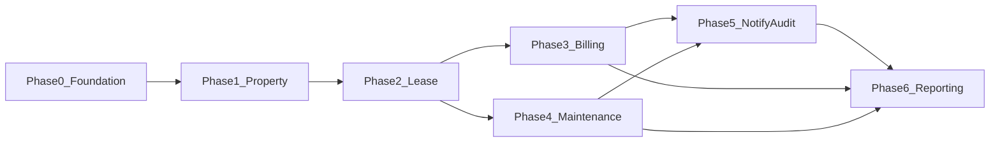

# Delivery phases and epics

Phased roadmap aligned with **`pms-web`** (roles `manager` / `super` / `renter`, see [`mockData.ts`](../pms-web/src/context/mockData.ts)), optional later alignment with [`pms-frontend/config/business.ts`](../pms-frontend/config/business.ts) for a broader console, and **`pms-backend`** Maven modules. Each phase ends with **Liquibase**, **OpenAPI**, a **minimal UI slice**, and **seed data** where applicable.

---

## Phase 0 — Foundation

**Goal**: Secure access, consistent roles, baseline admin operations.

### Epic 0.1 — Auth hardening

| Item | Acceptance criteria |
|------|---------------------|
| Login / refresh / profile | Matches contracts in `pms-backend/modules/user/_swagger/service/swagger.yaml`; error codes documented. |
| JWT claims | `USER_ID`, `ROLES_IDS` present on access and refresh paths. |

### Epic 0.2 — Role model alignment (`pms-web` ↔ backend)

| Item | Acceptance criteria |
|------|---------------------|
| Liquibase | New changeset applied; `role` table matches kickoff catalog ([BACKEND-ROLE-ALIGNMENT.md](./BACKEND-ROLE-ALIGNMENT.md)). |
| Java enum | `UserRoles` (or equivalent) uses **Property Manager / Superintendent / Resident** semantics and stable ids agreed with web. |
| API | Login/profile responses expose role information the web can map to `UserRole` without ad-hoc legacy names. |

### Epic 0.3 — Authorization baseline

| Item | Acceptance criteria |
|------|---------------------|
| Sensitive endpoints | Admin-only routes on `admin` / `user` management verified (extend `@PreAuthorize` or equivalent as pattern). |
| Docs | [RBAC-AND-DATA-SCOPE.md](./RBAC-AND-DATA-SCOPE.md) linked from backend README or this `docs/` index. |

**UI slice**: wire `pms-web` login to real JWT (replace mock `login()` in [`AppContext.tsx`](../pms-web/src/context/AppContext.tsx)); keep role-aware shell as today.

**Seed data**: users mirroring [`mockData.ts`](../pms-web/src/context/mockData.ts) (at least one `manager`, two `super`, several `renter` with units).

---

## Phase 1 — Portfolio truth (property hierarchy)

**Goal**: Property → Building → Unit as system of record.

### Epic 1.1 — Schema

| Item | Acceptance criteria |
|------|---------------------|
| Liquibase | Tables for org (optional), property, building, unit; FKs and indexes for list-by-property. |

### Epic 1.2 — APIs

| Item | Acceptance criteria |
|------|---------------------|
| OpenAPI | CRUD + list/filter under `property` module; examples for hierarchy. |
| Scope | Property manager queries restricted to assigned properties (MVP: all properties in org). |

**UI slice**: tree or table navigation for portfolio; unit detail drawer.

**Seed data**: one demo property with two buildings and N units.

---

## Phase 2 — Lease (core contract)

**Goal**: Lease lifecycle linked to units and parties.

### Epic 2.1 — Schema

| Item | Acceptance criteria |
|------|---------------------|
| Liquibase | Lease, status enum, parties, unit linkage; constraints for one active lease per unit policy (if required). |

### Epic 2.2 — APIs

| Item | Acceptance criteria |
|------|---------------------|
| OpenAPI | DRAFT → ACTIVE → EXPIRED / TERMINATED transitions; read filters by property/unit. |
| Documents | Upload/download uses `DOCUMENT_STORAGE_PATH` with lease id metadata. |

**UI slice**: lease wizard (draft), activation action, lease PDF attachment list.

**Seed data**: active lease for demo tenant user linked to demo unit.

---

## Phase 3 — Billing and ledger

**Goal**: Charges, invoices, payments, aging.

### Epic 3.1 — Schema

| Item | Acceptance criteria |
|------|---------------------|
| Liquibase | Invoice, line items, payment allocations; idempotency key on payment insert (recommended). |

### Epic 3.2 — APIs

| Item | Acceptance criteria |
|------|---------------------|
| OpenAPI | Issue invoice, record payment, list AR aging by property. |
| Events | Publish to Artemis on invoice issued / payment posted for `notification` consumer (stub OK). |

**UI slice**: tenant invoice list; manager AR dashboard (read-only chart acceptable MVP).

**Seed data**: open invoice + partial payment for demo tenant.

---

## Phase 4 — Maintenance operations

**Goal**: Work order lifecycle and assignment.

### Epic 4.1 — Schema

| Item | Acceptance criteria |
|------|---------------------|
| Liquibase | Work order, status, assignee, SLA timestamps, optional priority. |

### Epic 4.2 — APIs

| Item | Acceptance criteria |
|------|---------------------|
| OpenAPI | Create (tenant/manager), assign (manager), update status (assignee), close with notes. |
| Scope | Maintenance staff sees only assigned orders; tenant sees own requests. |

**UI slice**: technician queue; tenant “submit request” form.

**Seed data**: two work orders in different states.

---

## Phase 5 — Notifications and audit coverage

**Goal**: Users see timely updates; compliance trail on sensitive actions.

### Epic 5.1 — Notifications

| Item | Acceptance criteria |
|------|---------------------|
| Templates | At least invoice issued, payment received, work order assigned, lease activated. |
| Channels | In-app persistence + SMTP hook documented in `application-*.properties`. |

### Epic 5.2 — Audit

| Item | Acceptance criteria |
|------|---------------------|
| Coverage | Role changes, lease state transitions, billing adjustments emit audit events. |

**UI slice**: notification bell + mark read; admin audit search (minimal filter by user/date).

**Seed data**: template rows + sample audit rows.

---

## Phase 6 — Reporting and analytics

**Goal**: Operational and financial KPIs from live data.

### Epic 6.1 — Reports

| Item | Acceptance criteria |
|------|---------------------|
| APIs | Occupancy, revenue (period), AR aging, maintenance SLA breach count, lease expiry horizon. |
| Performance | Document expected indexes; optional materialized summary table for heavy portfolios. |

**UI slice**: reporting hub with export CSV for one report.

**Seed data**: enough history to show non-zero charts.

---

## Dependency overview

---

## Traceability

| Phase | Backend modules | `pms-web` (kickoff) | Optional: `pms-frontend` spec |
|-------|-----------------|---------------------|------------------------------|
| 0 | `user`, `admin`, `security-adapter` | `UserRole` + real JWT login | `systemRoles` |
| 1 | `property` | Manager portfolio / unit context | `specificationModules.properties` |
| 2 | `lease` | Resident lease renewal messaging | `leases` |
| 3 | `billing` | `RenterPayments`, manager payment views | `billing` |
| 4 | `maintenance` | Tickets (all three roles) | `maintenance` |
| 5 | `notification`, `audit` | In-app messaging + notices | `notifications` + audit UI |
| 6 | `reporting` | `ManagerReports` | `reporting` |
